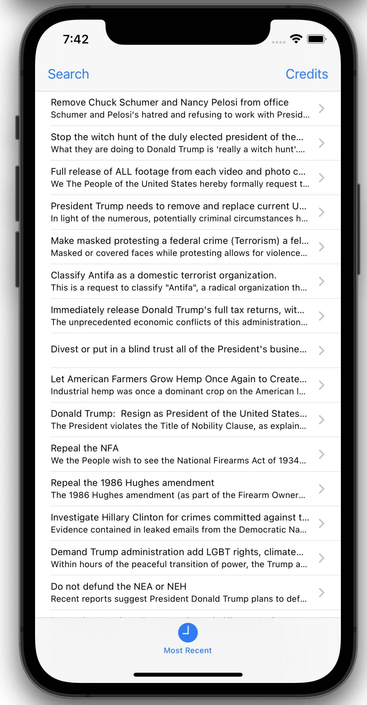
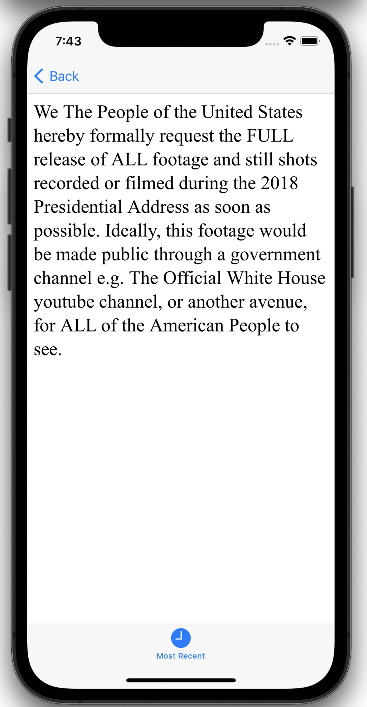
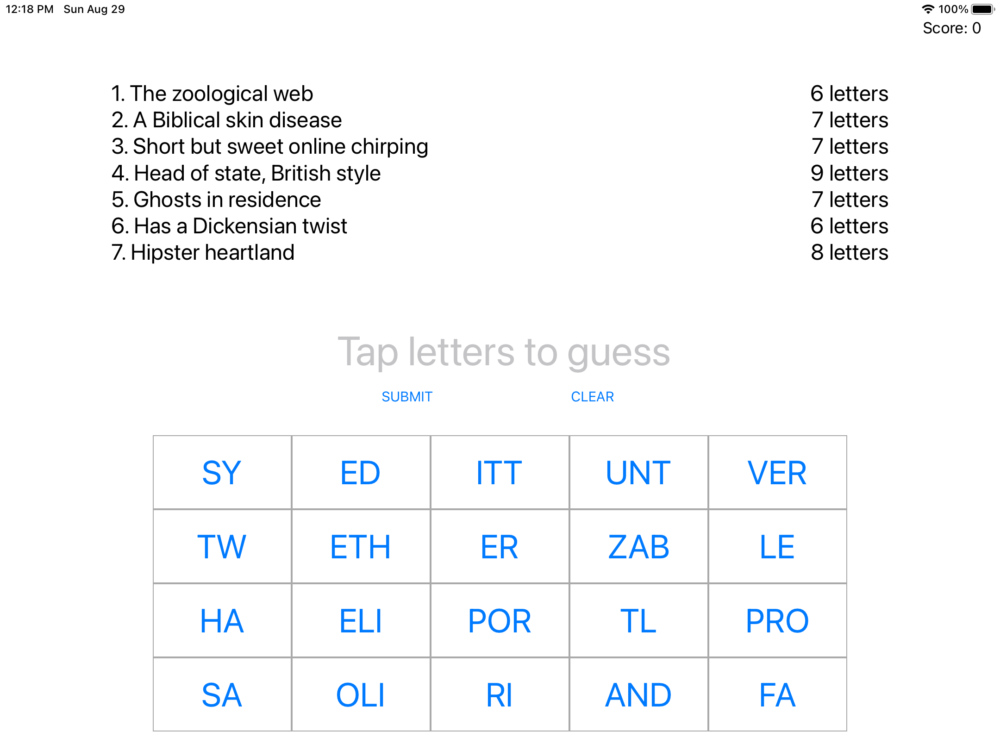
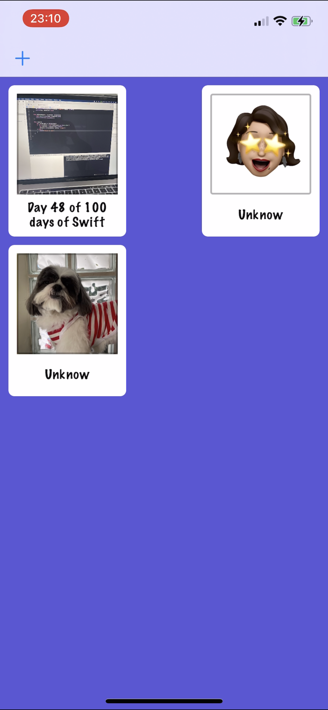
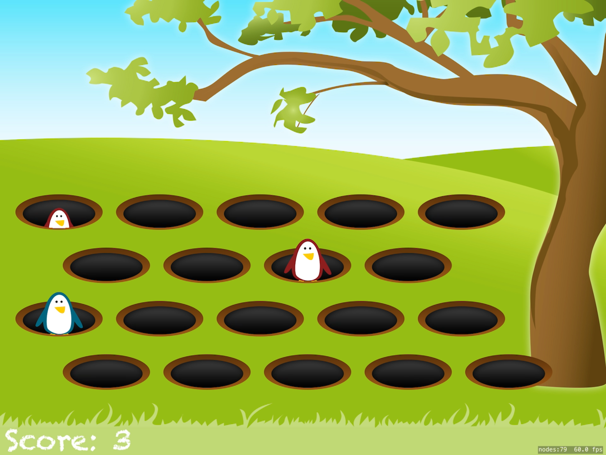
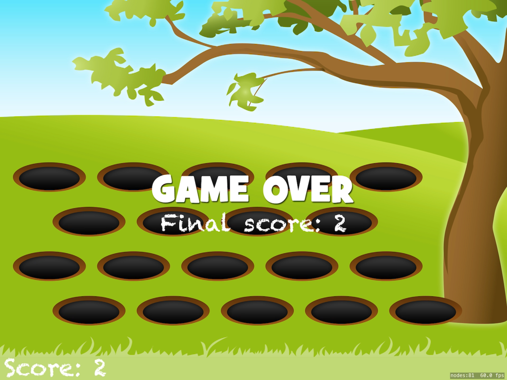
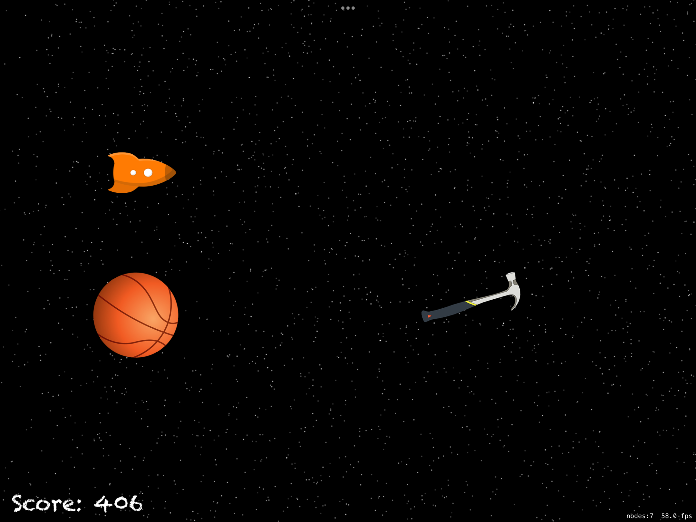

# 100-days-of-swift

Solutions to Paul Hudson's "100 days of Swift" projects and challenges.

https://www.hackingwithswift.com/100

## Completion status

Type                | Number  | Completion
:---                |  :---:  |   :---:
Projects            |  18 / 30 | 36%
Challenges          | ?? / 90 | ??%
Milestone Projects  | 3 / 10 | 30%
Core Graphics redux |  0 / 1  | 100%

## Notes
- This is 100 days of **Swift**.

## Preview

*Within each project are larger versions of the screenshots.*

Projects / Topics                                                                                                                                                            | Screenshots
---                                                                                                                                                                          |---
[Project 1](Project1) - *Storm Viewer*  (with challenges)                                           View controllers, Storyboard, FileManager                                |   |
[Project 2](Project2) - *Guess the Flag*  (with challenges)                                           UIButton, CALayer, IBAction                                              |  |
[Project 3](Project3) - *Social Media*  (with challenges)  (base: project 1)                        UIBarButtonItem, UIActivityController                                    |  |
[Milestone projects 1-3](04-Milestone-Projects1-3) - *Country Flags*                                                                                                            |   |
[Project 4](Project4) - *Easy Browser*  (with challenges)                                           WKWebView, Action sheets, UIToolbar, UIProgressView                      |   |
[Project 5](Project5) - *Word Scramble*  (with challenges)                                           Reading from disk, UIAlertController, IndexPath                          |  |
[Project 6](Project6) - *Auto Layout*  (with challenges)                                         Auto Layout, Constraints, Visual Format Language                         |   |
[Milestone projects 4-6](08-Milestone-Projects4-6) - *Shopping List*                                                                                                            |  |
[Project 7](Project7) - *Whitehouse Petitions*  (with challenges)                                           UITabBarController, JSON, Data, Codable                                  |   |
[Project 8](Project8) - *7 Swifty Words*  (with challenges)                                           UI in code, Text alignment, Layout Margins, UIFont                       |  |
[Project 9](Project9) - *Grand Central Dispatch*  (with challenges)  (base: project 7)                                           Grand Central Dispatch, PerformSelector                                  |   |
[Milestone projects 7-9](Milestone-Projects7-9) - *Hangman*                                                                                                           |     |
[Project 10](Project10) - *Names to faces*  (with challenges)                                 UICollectionView, UIImagePickerController, NSObject                      |  |
[Project 11](Project11) - *Pachinko*   (with challenges)                                        SpriteKit, Nodes, UITouch, Physics Body, SKAction, Collisions, Emitters  |   |
[Project 12](Project12) - *User Defaults*  (with challenges)   (base: project 10)                                     UserDefaults, JSON, NSCoding, Codable                                             |   |
[Milestone projects 10-12](Milestone-Projects10-12) - *Photo captions*                                                                                                        |   |
[Project 13](Project13) - *Instafilter*  (with challenges)                                         UISlider, UIImagePickerController, CIContext, CIFilter, Saving photos    |   |
[Project 14](Project14) - *Whack-a-Penguin*  (with challenges)                                         SKCropNode, SKTexture, SKAction                                          |   |
[Project 15](Project15) - *Animation*                                                           Animation, CGAffineTransform                                             |  |
[Milestone projects 13-15](Milestone-Projects13n15) - *Country facts*                                                                                                        |   |
[Project 16](Project16) - *Capital Cities*  (with challenges)                                         MapKit, MKMapView, MKAnnotation, CLLocationCoordinate2D                   |    |
[Project 17](22-Project17) - *Space Race*  (with challenges)                                         Collisions, Timer, Linear / Angular damping                              |   |
[Project 18](Project18) - *Debugging*                                                           Debugging                                                                | No screenshot |

[Milestone projects 16-18](Milestone-16-18) - *Shooting Gallery*                                                                                                        | |
